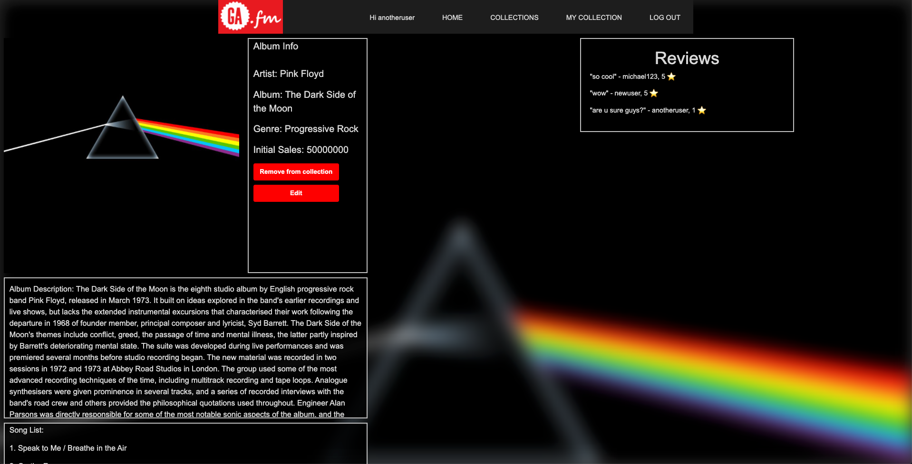
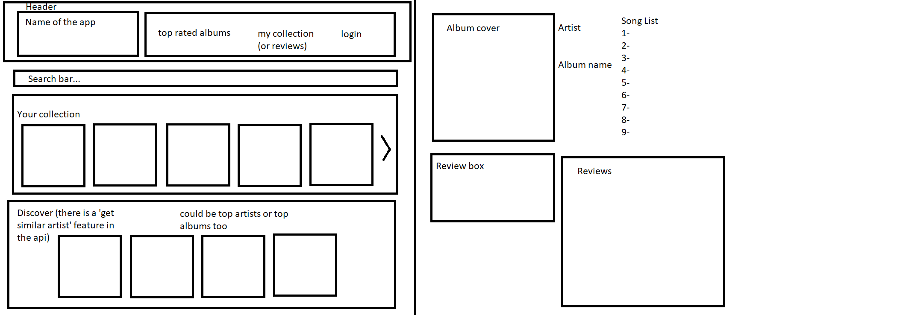

# GA.fm
Welcome to GA.fm, where you can keep track, rate, and review albums in your collection! All you need to is sign up, log in, and start the fun.

If you aren't quite ready to register an account, you can still poke around and see what you find. Getting album info from the Audio DB API, we provide you with fifty of users' favourites. Click on the album art in the "Top 50 Albums" bar on the home page to navigate to the album info. Marvel at the sales info! Tickle yourself with fun facts! Best of all, see what our esteemed user base has to say about the album; check out the "Reviews" section on the right side of the album page, and have the way you hear your favourite albums change forever.

# Screenshots

# Technologies Used
- Python 3
- Django
- PostgreSQL
- [TheAudioDB API](https://theaudiodb.com/api_guide.php)

# Getting Started
Start adding to your collection on [GA.fm](https://gafm.herokuapp.com/)!

If you're interested, take a look at our plans:
- [Trello](https://trello.com/b/cGOrG4QA/project-3)
- [Lucid Chart](https://app.lucidchart.com/publicSegments/view/759d0985-1a9b-4043-9b49-1dfb83942b20)

...and our wireframes:

# Planned Enhancements
- Search bar
- Average album rating
- Review comments